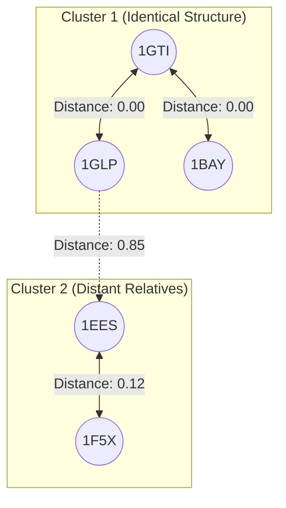

# Tutorial 1: The Magic of Vector Homology

Welcome to computational biology! If you're new to bioinformatics, you might be wondering: *How do scientists figure out what a newly discovered protein actually does?*

Proteins are the microscopic machines that run your body, and they are built from a simple 1D alphabet of 20 letters (amino acids). Traditionally, scientists used tools like BLAST to compare a new sequence to known sequences, looking for matching letters (like doing a `Ctrl+F` in a massive book). 

But nature is tricky. Sometimes two proteins have completely different sequences, yet they fold into the exact same 3D shape and perform the exact same job! How do we find "twins" that don't look alike on paper?

**Enter Vector Homology.**

## What is an Embedding?
Instead of reading letters, we pass the sequence through a mathematical algorithm that understands the "semantics" of biology (similar to how language models understand English). It converts the sequence into a dense list of numbers called an **embedding** (or vector). 

In `pg_bio`, we natively store these embeddings right next to the protein. Instead of matching letters, we measure the physical angle between two vectors—a metric called **Cosine Distance**.

## 1. Your First Search
Imagine you just sequenced a mysterious protein and want to find its closest relatives in your database. 

Instead of exporting data to Python, we can search the known biosphere directly in SQL!

```sql
SELECT 
    uniprot_id, 
    name, 
    embedding_cosine_distance(embedding, get_esm_embedding('YOUR_NEW_SEQUENCE')) as distance
FROM proteins
ORDER BY distance ASC
LIMIT 3;
```

**Real Example Output (Querying the `1BAY` sequence):**
```text
 uniprot_id |          name          | distance 
------------+------------------------+----------
 1GTI       | PDB Structure 1GTI     |   0.0000
 1GLP       | PDB Structure 1GLP     |   0.0000
 1GLQ       | PDB Structure 1GLQ     |   0.0000
```
*Wait, distance `0.0`?* Yes! The database instantly realized that `1GTI`, `1GLP`, and `1GLQ` are mathematically identical to your query. Even if they were crystallized under different lab conditions, `pg_bio` knows they are the same biological machine.

## 2. Building a Similarity Pipeline (Self-Joins)
Let's level up. What if we want to see how a whole family of proteins relates to each other? We can join the `proteins` table against *itself* to create a correlation matrix!

```sql
SELECT 
    p1.uniprot_id AS protein_a,
    p2.uniprot_id AS protein_b,
    ROUND(embedding_cosine_distance(p1.embedding, p2.embedding)::numeric, 4) AS evolutionary_distance
FROM proteins p1
JOIN proteins p2 ON p1.uniprot_id < p2.uniprot_id
WHERE p1.uniprot_id IN ('1GTI', '1GLP', '1EES', '1F5X')
  AND p2.uniprot_id IN ('1GTI', '1GLP', '1EES', '1F5X')
ORDER BY evolutionary_distance ASC;
```

## 3. Visualizing the Biological Network
Based on the embedding distances, we can map out the evolutionary clusters. Proteins with a low distance (e.g., < 0.2) share tight structural homology.

Here is a visual representation of how our database naturally clusters these proteins based purely on their vector similarities:



### What's Next?
Now that we've found our cluster of structurally identical proteins, how do we know which specific amino acids inside them are actually doing the important work? 

Move on to **[Tutorial 2: Attention Traversal](./02_attention_traversal.md)** to find out!
