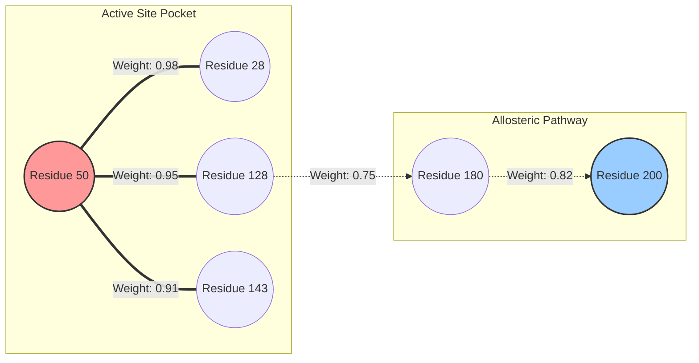

# Tutorial 2: Attention Traversal

Welcome back! In the previous tutorial, we used Vector Homology to discover a cluster of similar proteins. But proteins are large machines—sometimes hundreds or thousands of amino acids long. If we want to design a drug to inhibit this protein, where exactly do we target it?

**We need to find the "Active Site".**

## What are Attention Maps?
Modern computational models don't just generate a single vector for a protein; they calculate **interaction weights** between every single pair of amino acids. 

If amino acid #10 and amino acid #150 have a high interaction weight (attention), it means they are highly correlated. Even though they are far apart in the 1D text string, they likely fold together to physically touch in 3D space, forming a critical functional pocket!

## The Sparse Matrix Problem
For a 2,000-residue protein, the "attention map" is a $2000 \times 2000$ matrix. Storing this natively for millions of proteins would blow up any database's memory.

`pg_bio` solves this elegantly using a custom type called `SparseAttentionMap`. It only stores the mathematically significant interactions, effectively compressing gigabytes of dense matrices into lightweight, queryable data (a technique known as Compressed Sparse Row, or CSR).

## 1. Finding the Active Site
Let's ask the database to traverse the compressed network and tell us which residues interact most strongly with a known mutation point, say, residue 50.

```sql
SELECT get_top_interacting_residues(attention_data, target := 50, limit := 5) AS interaction_network
FROM protein_attention_maps
WHERE uniprot_id = '1BAY';
```

**Real Example Output:** 
```text
 interaction_network 
---------------------
 {50, 28, 128, 143, 134}
```
*Insight:* Residue 50 interacts with itself (expected), but it has massive evolutionary coupling with residues `28`, `128`, `143`, and `134`. These 5 residues likely form the functional binding pocket!

## 2. Tracing an Allosteric Pathway (A Small Pipeline)
Sometimes, binding a drug on one side of a protein causes a physical shift on the complete opposite side. This "domino effect" is called allostery. 

Because `pg_bio` stores attention maps natively, we can write a SQL query to traverse the protein graph, hopping from residue to residue to trace the communication pathway!

Imagine traversing from Residue 50 $\rightarrow$ Residue 128 $\rightarrow$ Residue 200:



By joining the attention map against itself (recursively mapping outputs to inputs), `pg_bio` allows scientists to map these entire communication networks instantly inside the database.

### What's Next?
We now know that residues `50`, `28`, and `128` are the core of our protein. But what do they actually look like in 3D physical space? How do we fetch the actual atoms of this pocket?

Move on to the final step: **[Tutorial 3: Z-Order Spatial Indexing](./03_spatial_indexing.md)**!
