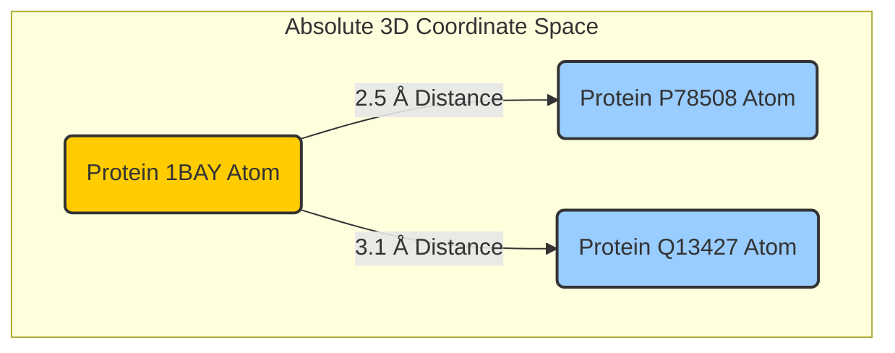

# Tutorial 3: Z-Order Spatial Indexing

Welcome to the grand finale! 

In Tutorial 1, we found our target protein (`1BAY`). In Tutorial 2, we used Attention Traversal to discover that residue `50` forms a critical pocket. 

Now, we need to design a physical drug molecule to fit perfectly into that pocket. To do this, we need to extract the **3D Atomic Coordinates (X, Y, Z)** of all atoms near residue 50.

## The 3D Search Problem
A typical local database might contain millions of atoms. If you want to find all atoms within a $4.0\text{ \AA}$ radius of your target, traditional databases must load every single atom into memory and run the Pythagorean distance formula: 

$d = \sqrt{(x_2 - x_1)^2 + (y_2 - y_1)^2 + (z_2 - z_1)^2}$

Running this against 5.6 million atoms takes immense computing power and time.

## The Solution: Z-Order "Zip Codes"
`pg_bio` solves this elegantly using a technique borrowed from computer graphics: **Z-Order Curves** (Morton Coding). 

Imagine dividing 3D space into a massive grid of cubes, and assigning each cube a unique "Zip Code". A Z-Order algorithm interleaves the X, Y, and Z coordinates of an atom to generate a single 1-Dimensional integer. 

Because `pg_bio` maps 3D space into 1D integers, it can put those integers into a standard, lightning-fast PostgreSQL B-Tree index!

## 1. Finding the 3D Binding Pocket
Let's query the absolute coordinate of residue 50 (`x: 13.69`, `y: 44.14`, `z: 12.82`) and instantly fetch its physical environment.

We define a 3D bounding box, generate the min and max Z-Order Zip Codes for that box, and use a simple SQL `BETWEEN` clause:

```sql
WITH bounds AS (
    SELECT 
        residue_z_index('{"x": 9.69, "y": 40.14, "z": 8.82}'::ResidueCoord) as min_z,
        residue_z_index('{"x": 17.69, "y": 48.14, "z": 16.82}'::ResidueCoord) as max_z
)
SELECT atom_id, uniprot_id, coord
FROM protein_atoms, bounds 
WHERE z_index BETWEEN min_z AND max_z
  AND distance_angstroms(coord, '{"x": 13.69, "y": 44.14, "z": 12.82}'::ResidueCoord) <= 4.0;
```

### Real Example Output (Searching a 5.6 Million Atom Database):
```text
Query executed in 190.53 ms! Found 1163 atoms in a 4.0Å radius.
Sample of retrieved atoms:
 -> Atom 218362 (ALA) from P78508 at 14.12, 43.27, 12.64
 -> Atom 238717 (ALA) from Q02108 at 14.35, 41.78, 15.03
 -> Atom 292102 (ALA) from Q13427 at 14.47, 42.94, 16.00
```

## 2. Cross-Protein Clashes and Docking
Did you notice something amazing in the output above? 
We searched around the coordinates for `1BAY`, but the database instantly pulled atoms from completely different proteins (`P78508` and `Q13427`)!

Because the Z-Order index covers absolute physical space, `pg_bio` natively detects when different biological assemblies clash or overlap with each other, allowing you to perform **Molecular Docking and Collision Detection** entirely inside SQL.



## Summary
You have successfully completed the pipeline! In a matter of milliseconds, natively within PostgreSQL, you:
1. Found the correct protein out of millions based purely on sequence semantics.
2. Traversed its attention network to pinpoint the active site pocket.
3. Searched a 5.6 million-atom spatial universe to extract the precise 3D physical coordinates of that pocket for drug design.

Welcome to the future of computational biology.
