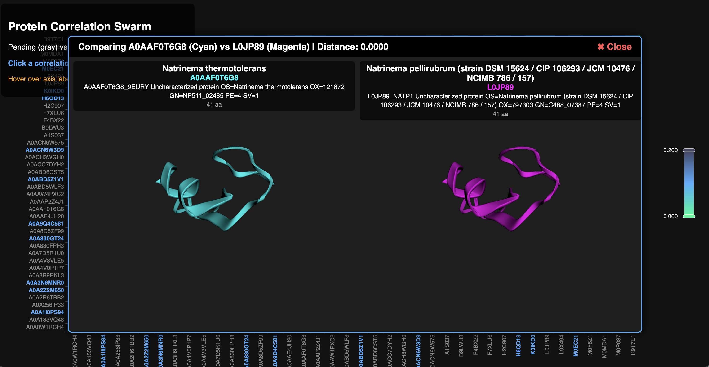

# Protein Correlation Swarm 🧬🦠

Welcome to the **Swarm Discovery** ecosystem! 

Unlike linear discovery scripts that just loop over a static list of keywords, this swarm behaves like a graph-exploration algorithm. It starts with a seed protein and recursively branches out, using vector similarity to find the nearest structural neighbors in the dark proteome across entirely different organisms and ecosystems.

## Components

This example is split into two interoperating scripts:

1. **`swarm_discovery.py`**: The background worker. It pulls "Pending" proteins from the PostgreSQL `orphan_discoveries` table, vector-searches their top 5 closest evolutionary neighbors, marks the original as "Explored", and queues the new neighbors for future exploration. It effectively maps out a massive, self-expanding tree of life.
2. **`swarm_web.py`**: A live visualizer dashboard. It runs a Flask web server that draws a beautiful ECharts heatmap representing the pairwise cosine distances between the top 40 nodes currently in the swarm graph.

## The Dashboard UI

When you run the web server, you will see an interactive heatmap. 
- **Pending nodes** are grayed out.
- **Explored nodes** are highlighted in blue.

You can hover over the X or Y axis labels to instantly see rich biological metadata (Organism name, UniProt ID, sequence length).

**Interactive 3D Comparison:**
If you click on any correlation cell, a modal pops up showing a side-by-side comparison of the two proteins in interactive 3D! The viewers are synchronously linked, meaning if you drag or zoom on one protein, the other will perfectly follow your camera movements in real-time.


*(Example: Finding correlated organisms from completely different ecosystems!)*

## Usage

You'll want to run these two scripts in separate terminal windows (or as background daemon tasks):

### 1. Start the Swarm Agent
```bash
uv run python swarm_discovery.py
```

### 2. Start the Live Web Dashboard
```bash
uv run python swarm_web.py
```
Then, open your browser to **http://localhost:8080** to watch the swarm graph grow!

## Smart Folding Fallback
If the web UI encounters a massive, uncharacterized protein that doesn't exist in the EBI AlphaFold database, it doesn't just crash! It will gracefully intercept the missing file, extract the amino acid sequence from PostgreSQL, and attempt to fold the 3D structure on-the-fly using `pg_bio`'s ESMFold integration. 

If the protein is too massive for your local hardware (e.g. >400 amino acids throwing an `HTTP 413` error), it uses a clever **Domain Chunking** strategy to chop the protein into pieces, fold them, space them out, and stitch them back together into a single unified 3D visualization.
